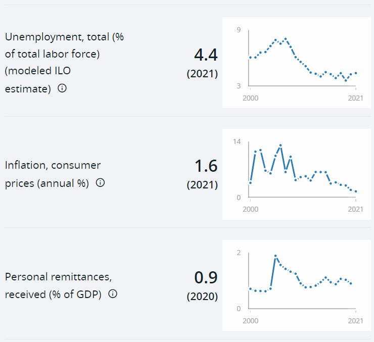
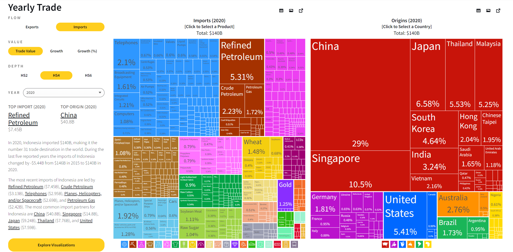

<!-- _class: lead -->

# Республика Индонезия

---

1. **Форма правления**: Президентская Республика
2. **Дата основания**:

   - 17.08.1945 провозглашена;
   - 27.12.1949 признана
3. **Официальные языки**: индонезийский
4. **Религия:** Преимущественно Ислам 86.6% (2000 год)
5. **Население:**   - 275 773 800 чел. (февраль 2022 г.)
6. **Президент**: Джоко Видодо
7. **Вице-президент**: Мааруф Ами

---

8. **Выборы**:
   - Президент и вице-президент избираются сроком на пять лет тайным голосованием на всеобщих прямых выборах.
   - Один и тот же человек не может занимать президентский пост более двух сроков подряд.
   - Выборы были в 2014, 2019. Выбрали на два срока.
   - Следующие выборы - 2024
9. **Кол-во партий:**  10
10. **Самая большая партия:**
    - *Демократическая партия борьбы за Индонезию*.
    - От туда президент

---

# Цели Джоко Видодо 2019 - 2024

1. Продолжение развития инфраструктуры
2. Развитие человеческих ресурсов
3. Привлечение инвестиций в максимальной степени
4. Реформирование бюрократии
5. Обеспечение того, чтобы расходы государственного бюджета более целенаправленными

---

<!-- _class: lead -->

# 2017 - 2022

---

# 2017:

- Выборы местные, сложные с побоими

# 2018:

- Азиатские игры и Азиатские Параигры
- Серия терриросетичесих актов

---

# 2019

- Переизбрание президента
- Избрание новых человнов  Народной консультативной ассамблеи
- Избрание новых человнов метсных законадательных органов
- Бастовки со стороны Прбово
- Протесты студентов из-за нового кодекса

---

# Пабово vs Джоко

- Было два прентендента на пост президента
  - Джоко Виводо (прошлый президент)
  - Прабово Субианто (бывший генерал лейтинант армии)

Прабово призывал своих сторонников бастовать и протестовать против решения. Так как не признал выбор в пользву Джоко Виводо. Попбастовали 2 месяца. В процессе несколько человек умерло. А потом Прабово сказал "разойтись по домам, отдохнуть и довериться закону", заявив о своем намерении оспорить результаты выборов

---

# Протесты студентов

- 23 сентебря - 30 сентября. До конца сесси парламента
- 300.000 студентов
- 24 сентебря выдвинули ряд требований:
  - Против корупции. Новые поправки вводили послабления в часть конституции о корупции
  - Против Вырубки лесов
  - Против уголовоного кодекса в котором есть ответсвенность за внебрачный секс и клевету на президента.
- С окончанием парламентсокй сессии протесты закончился

---

# Итоги протестов

- 5 погибших, 30 арестованных.
- Правительсвто высказалось, что оно категорически против насильственного изменения конституции и что вопрос должен быть урегулирован в рамках конституционной процедуры путем подачи заявления в Конституционный суд.

---

# 2020

- Начало ковида и ограничений
  - закрытие общественных мест, школ,
  - ограничение общественного транспорта
- Октябрьские протесты студентов. Против нового закона о создании рабочих мест. Минимальная ЗП. Все же приняли.
- Посадили двух министров:
  - Social Affairs
  - Marine Affairs and Fisheries Minister
- Пепел вулкана Семеру

---

# 2021

- Новая волна COVID
- Вакцинация президента в прямомо эфире
- Стихийные бедствия:
  - Землятресение
  - Циклон Сероджа
    - ветер достигал 120-140 км в час.
      (90 км\ч вырывает деревья)
  - Извержение вулкана Семеру

---

# 2022

- G20 на Бали (Это Индонезия)
- Апрель протесты студентов
  - Против переноса выборов 2024
  - Против поправок в конституцию, продления на третий срок

---

<!-- _class: lead -->

# План 2045

---

# Vision of Indonesia 2045

- Джоко Видодо 9 мая 2019 года представил <blue> **Visi Indonesia 2045** </blue>
  - Индонезийский идеал: суверенная, развитая, справделивая, процветающая страна
  - Представляет, что войдет в **топ 5 экономик** мира
  - ВВП **7.3 трл $**
  - Доход на душу населения - **25 000$**

---

# Цели плана Индонезия 2045

- Цели базируется на цетырех столпах:
  - Развитие человеческого потенциала и развитие науки и техники
  - Устойчивое экономическое развитие
  - Справедливое развитие
  - Укрепление национальной устойчивости и управления

---

# Цели плана Индонезия  2045

- В связи с этим есть есть 4 цели:
  - Защитита всех граждан Индонезии и людей на ее територии
  - Способствование общему благосостоянию
  - Просвещать национальную жизнь (Enlighten the national life)
  - Осуществление мирового порядка, основанного на свободе, вечном мире и социальной справедливости

---

<!-- _class: lead -->

# Экономические показатели

<!-- https://data.worldbank.org/country/indonesia -->

---

# ВВП

- ВВП - 1.19 trillion $
- ВВП на душу - 4.291 $
- Рост ВВП - 3.7 (2021)
- Рост ВВП - 5.2 (2022 прогноз)

<!-- # Индекс человеческого капитала  -->

---

<!-- _class: lead -->

- Безработица - 4.4%
- Инфляция на потребительские товары 1.6%
  - Прогнозы от FocusEconomics:
    - 4.3% (2022)
    - 4.3% (2023)
- Деньги из-за рубежа, в диаспору - 0.9%

<!-- --- -->

<!-- GDP annual growth % -->

<!--  -->

<!--  -->

---
<!-- _class: lead -->

| Название показателя                                         | Значение | Год |
| ----------------------------------------------------------------------------- | ---------------- | ------ |
| Государственный дог (% от ВВП)                    | 42.9%            | 2020   |
| Прямые иностранные инвестиции (% от ВВП) | 1.8%             | 2020   |

---

<!-- _class: lead -->

# Соцаильные показатели

<!-- https://data.worldbank.org/country/indonesia -->

---

<!-- _class: lead -->

- Коф. бедности - **3.5 %** в день
- Продолжительность жизни - **72**
- Население - **276 361 788**
  - Мужчин - 139,131,289 (50%)
  - Женщин - 137,230,499 (49.7%)

---

<!-- _class: lead -->

- Прирост населения - 1%
- Общая миграция - 
(**- 494 777**)
- Индекс человеческого капитала - **0.5%**

---

<!-- _class: lead -->

| Название показателя                                                                                          | Значение | Год |
| ------------------------------------------------------------------------------------------------------------------------------ | ---------------- | ------ |
| Умышленные убиайства (на 100.000 чел)                                                             | 1                | 2004   |
| Использование Интернета (% от населения)                                                 | 54 %             | 2020   |
| Доля мест, занимаемых  женщинами в национальных  парламентах (%) | 21 %             | 2021   |

---

<!-- _class: lead -->

# Salary

<!-- https://bdeex.com/indonesia/ -->

---

<!-- _class: lead -->

| Название показателя                                   | Значение        |
| ----------------------------------------------------------------------- | ----------------------- |
| Прожиточный минимум                                   | 300\$ \| 4.64 IDR mln |
| Минимальная ЗП *Зависит от региона* | 130\$ - 325$           |
| Средний показатель ЗП                                | 560\$ - 630\$          |
| Налги на доход                                              | 5% - 30%                |

Налог 30% - если доход больше 500.млн рупий в месяц ~ **32 300$**
В столице в среднем на 15% зарплата больше

---

<!-- _class: lead -->

| Сфера бизнеса     | 2022 | 2021 |
| ----------------------------- | ---- | ---- |
| Large companies (250+)        | 770  | 747  |
| Medium Companies (100 to 250) | 605  | 587  |
| Small companies (up to 100)   | 495  | 480  |
| Micro Enterprises (up to 15)  | 330  | 320  |
| Public Sphere                 | 440  | 427  |

---

<!-- _class: lead -->

| Sector        | Salary\$   |  | Sector       | Salary\$   |
| ------------- | ---------- | - | ------------ | ---------- |
| IT            | 421 - 1015 |  | Trading      | 277 - 559  |
| Design        | 501 - 674  |  | Beauty       | 297 - 584  |
| Marketing     | 441 - 470  |  | Production   | 352 - 654  |
| Accounting    | 381 - 654  |  | Transport    | 257 - 634  |
| Office        | 322 - 762  |  | Construction | 337 - 832  |
| Jurisprudence | 307 - 2958 |  | Safety       | 426 - 1249 |
| Education     | 307 - 2713 |  | Agricultural | 361 - 460  |
| Medicine      | 332 - 956  |  |              |            |
| Restaurants   | 337 - 589  |  |              |            |

---

<!-- _class: lead -->

| Проф.            | ЗП\$ | Проф.                | ЗП\$ |
| -------------------- | ------ | ------------------------ | ------ |
| Go Developer         | 1015   | HR Director              | 762    |
| Python developer     | 812    | Judge                    | 2958   |
| C++ developer        | 802    | Notary                   | 1377   |
| UX/UI designer       | 674    | Rector of the University | 2713   |
| Game designer        | 673    | Cook                     | 436    |
| Marketing specialist | 470    | Chef                     | 589    |
| Event Manager        | 441    | Sales Manager            | 599    |
| Auditor              | 654    | Store Director           | 545    |
| Trader               | 881    | Fitness Trainer          | 584    |

---

<!-- _class: lead -->

# Economic

# Export & Import

<!-- https://oec.world/en/profile/country/idn?yearlyTradeFlowSelector=flow1 -->

---

---

---

<!-- _class: lead -->

# Конфликты

---

# Этнические конфликты

<!-- Открытые и латентыне конфликты -->

<!-- https://en.wikipedia.org/wiki/Category:Ethnic_conflicts_in_Indonesia -->

- с 1998 - 2002 было множество этнических конфликтов
  - Между мигранатами и кореными жителями
  - Между мусульманами и христианами

Было много насилия, но в конце концов был подписан ряд мирных соглашений

- 2010 Tarakan riot - Конфликт из-за смерти старейшины. Продлился 2 дня.

  <!-- внутренние , международно-политические, этнорелигиозные и т.д. -->

---

# Сепаратисткие конфликты
<!-- https://asiafoundation.org/wp-content/uploads/2017/10/Indonesia-StateofConflictandViolence.pdf -->
- Провинция Ачех (Aceh)
  - Обещали признать независимым, но дали особой статус
  - Были военные конфликты, но после цунами 2004 подписали соглашения
- Папуа Новая Гвинея.
  - Вопрос ресурсов
  - Индонезийцы на территории Папуа

---

# Внешние конфликты

- Теракты в Джакарте 14 января 2016 года
  - (Запрещенная в России террористическая оргонизация)
- Есть представители радикального исламизма -> все вытекающие

---

# Уровень роботизации

<!-- _class: lead -->

---

<!-- какие роботы применяются , 
  в каких сферах, 
  соотношение на душу населения в стране  ( по сравнению с соседями и в общем на международной арене) -->

---

<!-- _class: lead -->

#### Робот по имени Дельта, созданный из переработанных предметов домашнего обихода

---

<!-- _class: lead -->

# Цифровизация & Патенты

---

<!--    -->

<!-- _class: lead -->

# Уровень цифровизации

#### digital competitiveness ranking

  51 место в 2022 г
  показатель - 50.15%

---

# Кол-во патентов

<!-- https://www3.wipo.int/ipstats/index.htm?tab=trademark -->

<!-- https://gtmarket.ru/ratings/world-patent-ranking -->

<!-- https://www.internationalpropertyrightsindex.org/country/indonesia -->

<!-- https://nonews.co/directory/lists/countries/number-patents -->

<!-- _class: lead -->

| Название                          | Значение |
| ----------------------------------------- | ---------------- |
| Место в общем рейтинге | 17               |
| Заявки рездентов           | 3093             |
| Заявки не резидентов    | 8388             |
| Всего заявок                   | 11 481           |

---
<!-- _class: lead -->

#  Michael Porter
#
# Dimond

---

# Детерминанты 

1. Факторные условия 
2. Спрос на внутреннем рынке на товары или услуги, предлагаемые  отраслью
    - структура внутреннего спроса (природа покупательских потребностей)
    - Объем и характер роста внутреннего спроса 
    - Механизмами, с помощью которых преимущества на внутреннем рынке передаются на зарубежные рынки
---

3. Национальные преимущества в отрасли
    - наличие в стране отраслей-поставщиков или смежных отраслей, которые конкурентоспособны на мировом рынке
    
4. Конкурентоспособность отрасли